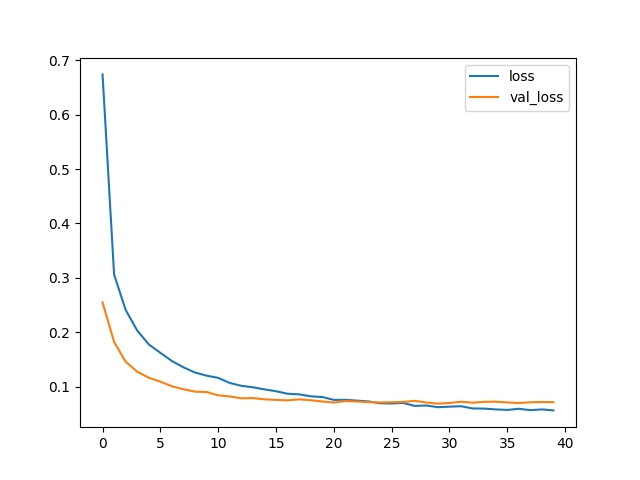
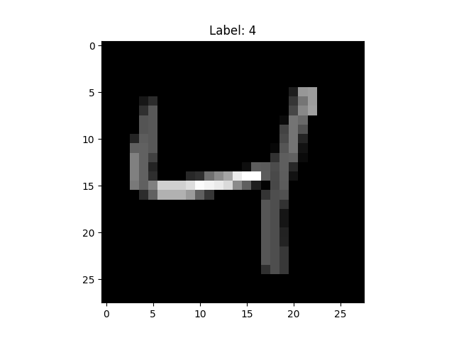
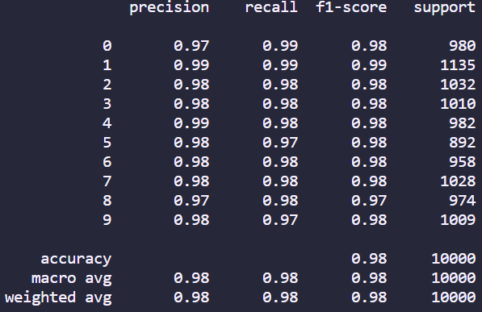

# Handwritten Digit Recognition: Neural Network Python Project

## Description

In this project I used neural networks to recognise handwritten numbers using the MNIST dataset. This dataset comprises of 70,000 small images of digits handwritten by high school students and employees of the US Census Bureau. Each image is labeled with the digit it represents. For more info, click [here](https://keras.io/api/datasets/mnist/).

For this project, the technologies used were:

- python 
- tensorflow
- cv2
- pandas
- numpy
- seaborn
- matplotlib

My biggest challenged faced was having low accuracy using custom data. After training and testing the data using the MNIST dataset, I then went to apply the model to my own images that I drew using a 3px black brush on a 28x28px white space on paint. Initially, even though my model had 98% accuracy on the MNIST testing data, when I ran it on my own drawn images I found that the accuracy was only around 50%. 

In the MNIST dataset, **all images are size normalized to fit in a 20x20 pixel box and there are centered in a 28x28 image using the center of mass**. Originally when I drew my data most of the numbers were off center and touched the sides of the 28x28px image which is exactly not what the MNIST dataset looked like. Hence, I redrew my numbers so they looked more similar to the MNIST dataset. The lines drawn in the MNIST dataset also looked thick so I kept the 3px black brush. As a result, after this data preprocessing I found my accuracy jumped to 90%.

What I learnt from project stressed the importance of data preprocessing and cleaning in the machine learning pipeline. No matter how sophisticated the model is, the quality and format of the input data significantly impacts the model's performance, hence why aligning my custom data format with the format of the MNIST dataset increased the accuracy drastically.

## Installation

To install this project you will have to download the repository from github and runit locally from your CLI. To be able to use this project python will have to be installed, which can be found [here](https://www.python.org/downloads/).

## Usage

Once installed you can use this project by entering the repository location using your CLI. Once entered into the repository you can run the project by entering the following in the CLI:

1. Creating a virtual environment: ```python -m venv .venv```
2. Activating the virtual environment: ```source .venv/Scripts/activate```
3. Downloading all the required packages: ```pip install -r requirements.txt```
4. Running the file: ```python main.py```

Once run graphs, numbers from the dataset and classification metrics will show similar to below:




